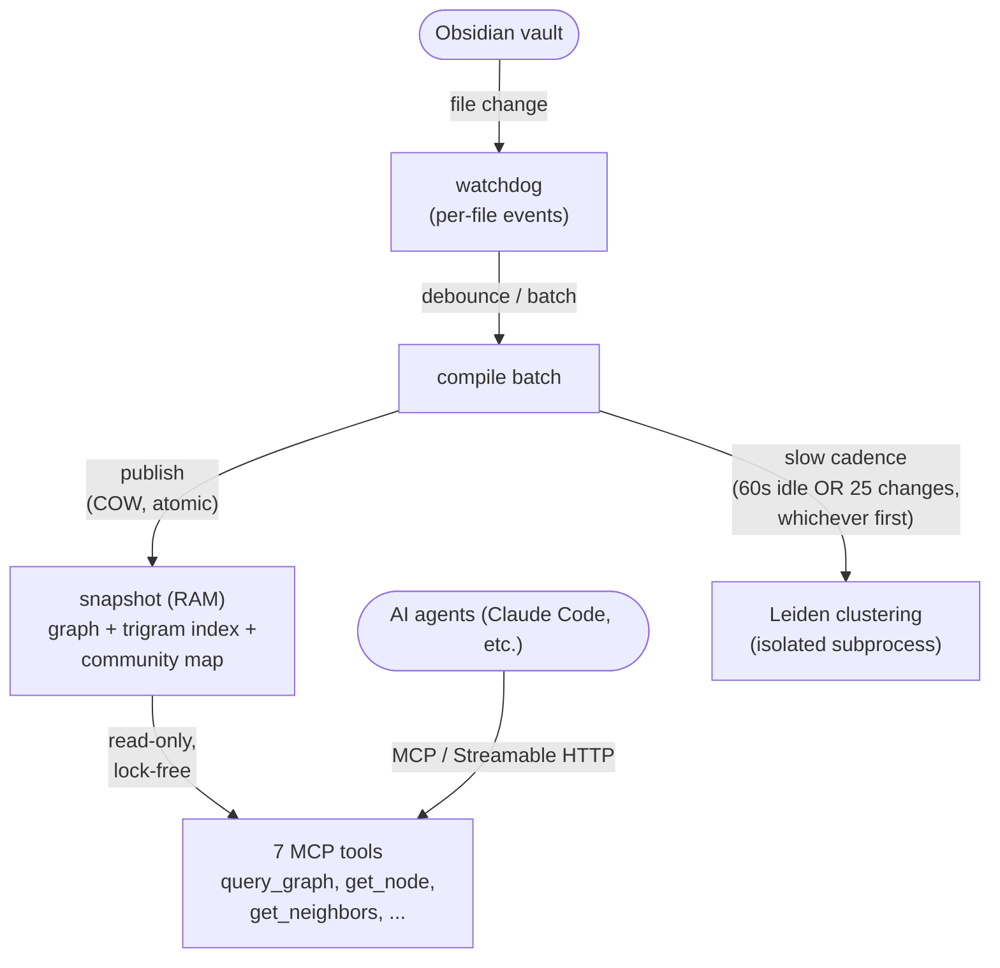

<p align="center">
  
</p>

# graphify-daemon

[](https://github.com/c-ibarra/graphify-daemon/actions/workflows/ci.yml)
[](LICENSE)
[](https://www.linkedin.com/in/carlosibarra)

A local daemon that keeps a knowledge graph derived from an [Obsidian](https://obsidian.md/) vault resident in RAM and serves it to concurrent AI coding agents over [MCP](https://modelcontextprotocol.io/), so an agent can ask "what connects to X" and get an answer in milliseconds instead of re-reading and re-inferring the same context from raw files every session.

**Highlights:** Python · MCP protocol (Streamable HTTP) · concurrency & subprocess isolation · 249 tests, CI-gated (`ruff` + `mypy --strict`) · documented design decisions (ADRs) · [6 real production bugs found & fixed](#production-bugs-found--fixed), each with documented root cause

## The problem

Agents working against a large vault were burning 15k–60k tokens a session just re-reading files to rebuild context they already had. The old pipeline — a per-file watcher script — made every part of that worse:

| | Legacy pipeline | graphify-daemon |
|---|---|---|
| Rebuild unit | per changed file | per debounced batch |
| Cost of a 50-file batch | ~75s (one full rebuild per file) | one rebuild, total |
| Cache reload | 26 MB reloaded from disk on every file | resident in RAM, incremental |
| Community ID stability | 88.63% churn between runs | <5% churn (tested), via stable remapping |
| Concurrent read safety | none for its SQLite index | lock-free reads against immutable snapshots |

Keeping one consistent graph snapshot in memory and answering queries straight from it, instead of re-reading the vault on every request, fixes all four at once.

## What it does



The vault is the only system of record. Everything else — the in-RAM graph, the trigram index, `graph.json`, `KNOWLEDGE.md`, `vault_index.db` — is disposable in the sense that matters for recovery: all of it can be rebuilt from the vault on cold start, so nothing needs backing up. That's not the same as saying it's not confidential — derived artifacts still carry vault-derived names, relationships, and relative paths, so every file and directory this daemon writes (cache, index, graph JSON, knowledge Markdown, logs) is created owner-only (`0600`/`0700`) on POSIX, and neither the API key nor the vault's absolute path ever appears in a log line. There's no mutation API anywhere; agents can only read.

## Design decisions worth reading

**Snapshots publish copy-on-write.** A writer builds an entirely new snapshot — graph, pre-warmed trigram index, community map — off to the side, then swaps a single reference. Readers grab that reference once per request and never take a lock, so every concurrent query sees a consistent view even while the next snapshot is being built underneath it.

**File changes get debounced, not rebuilt one by one.** A `threading.Timer`-based debounce collapses a burst of vault edits into a single compile-and-publish cycle — it's the main reason a 50-file batch went from ~75s to one rebuild.

**Clustering runs in its own subprocess, on purpose.** Leiden community detection takes ~750ms, long enough to matter, so it happens in a `multiprocessing.spawn` child that gets a pickled, private copy of the graph. `fork()` and shared memory were both considered and rejected first; the reasoning is written up in [`docs/adr/0001-cluster-worker-graph-handoff.md`](docs/adr/0001-cluster-worker-graph-handoff.md).

**Community IDs don't get reshuffled every run.** They're remapped against the previous assignment instead of reassigned from scratch, which is how the legacy pipeline's 88.63% churn turns into a tested <5% here.

**There's no durability layer, and that's deliberate.** No WAL, no replay, no checkpoint for the daemon's own state — recovery always means rebuilding from the vault. A test statically scans the whole source tree to keep that true, not just a doc claiming it.

**A duplicated auth header is rejected outright, not resolved to a value.** `X-API-Key` or `Authorization` sent twice is treated as absent — even if one of the two values is correct — rather than silently picking the first or last one. See [`docs/adr/0002-reject-duplicate-auth-headers.md`](docs/adr/0002-reject-duplicate-auth-headers.md).

**The clustering subprocess drains its result queue before joining it, not after.** A community-map result larger than the OS pipe buffer used to deadlock the parent and the child against each other — the classic `multiprocessing.Queue` pitfall, found and fixed while building the benchmarks below. See [`docs/adr/0003-drain-clustering-queue-before-join.md`](docs/adr/0003-drain-clustering-queue-before-join.md).

**There's no manually-bumped version number, on purpose.** Instead, the running daemon reports the exact git commit (and dirty/clean state) it was started from via `GET /metrics` — a fact computed at process start rather than a number someone has to remember to update. See [`docs/adr/0004-self-reported-revision-over-manual-versioning.md`](docs/adr/0004-self-reported-revision-over-manual-versioning.md).

**A rename is compiled as delete-then-create, not a dedicated fast path.** The previous path's cache and index state is removed first, then the destination is extracted exactly once through the same code as a normal create — reusing two already-correct paths instead of building and maintaining a third just to skip one extraction call. See [`docs/adr/0005-rename-as-delete-then-create.md`](docs/adr/0005-rename-as-delete-then-create.md).

**MCP tool errors return a fixed generic message, never the real exception text.** An unexpected failure is logged in full for operators, but the client only ever sees a constant, tool-named message — an allowlist by construction, not a blocklist that has to catch everything that could leak (a file path, node content, an internal function name). See [`docs/adr/0006-mcp-errors-fixed-generic-message.md`](docs/adr/0006-mcp-errors-fixed-generic-message.md).

## Production bugs found & fixed

Six real bugs, each with a documented root cause — the number the Highlights line above counts, not a rounder marketing figure:

1. **Clustering subprocess deadlock.** `run_clustering_subprocess` called `process.join()` before draining `result_queue`; a community-map result past ~8,000 nodes exceeded the OS pipe buffer (~64KB), leaving the child blocked writing while the parent blocked reading nothing. Found building `benchmarks/` — every one of 5 runs hit the timeout, with `process.is_alive()` still `True` at the 60s mark while the queue already held a valid result. Fixed by draining the queue before joining. See [ADR 0003](docs/adr/0003-drain-clustering-queue-before-join.md).
2. **Unbounded graceful-shutdown hang.** The MCP subscriptions/listen stream this daemon deliberately keeps open never closes on its own, so `uvicorn`'s default (`timeout_graceful_shutdown=None`) waited for it forever. Found live: `SIGTERM` against the running production daemon left it refusing connections for 35+ seconds, and derived-artifact mtimes proved `persist_on_shutdown()` never ran. Fixed with a bounded 5s graceful-shutdown timeout.
3. **Cross-thread SQLite connection.** The vault index's `sqlite3` connection was created on the daemon's init thread but used from the debounce timer's own thread on every flush — `sqlite3.ProgrammingError` on every real batch since startup, silently stalling the graph at cold-start state. All 147 relevant unit tests missed it because they call `sync_batch` synchronously, in-thread. Found reading live `launchd` logs while debugging an unrelated client-connection failure; fixed with `check_same_thread=False` (safe, since the single-writer batch consumer already serializes access) plus a regression test reproducing the real cross-thread shape.
4. **Stateful MCP sessions broke a real client.** `StreamableHTTPSessionManager` defaulted to stateful sessions; a client that doesn't echo `Mcp-Session-Id` back after `initialize` got a 404 on every follow-up request, which it misread as an auth failure. Verified via `curl` (404 before the fix, 200 after) and fixed with `stateless=True`, matching `graphify.serve`'s own `--stateless` option.
5. **Misleading truncation reporting.** `_cut_lines_to_budget` reported "0 more lines cut" whenever a single line alone exceeded the token budget, even though real content was truncated — a line-count delta doesn't reflect a mid-line cut. Fixed to detect and report that case explicitly, with regression tests added for the empty-graph, cache, and off-loop edge cases swept at the same time.
6. **Vault path leak through extractor errors.** Raw extractor error text could surface the vault's absolute path to an MCP client — a real confidentiality leak, not just a theoretical one. Fixed by returning a fixed, tool-named generic message for any unexpected tool failure, with the real exception still logged in full for operators. See [ADR 0006](docs/adr/0006-mcp-errors-fixed-generic-message.md).

## MCP tools

All seven tools read exclusively from the resident snapshot — no disk access on the query path.

| Tool | Purpose |
|---|---|
| `query_graph` | BFS/DFS graph search returning text context for a question, token-budgeted |
| `get_node` | Look up a node by label (case-insensitive) |
| `get_neighbors` | Successors/predecessors of a node, with relation and confidence |
| `get_community` | All nodes in a given community |
| `god_nodes` | The most-connected nodes in the graph |
| `graph_stats` | Node/edge/community counts and confidence-level breakdown |
| `shortest_path` | Shortest path between two nodes |

## Tech stack

[](https://www.python.org/)
[](https://pypi.org/project/mcp/)
[](https://www.starlette.dev/)
[](https://www.uvicorn.org/)
[](https://www.python-httpx.org/)
[](https://pypi.org/project/watchdog/)
[](https://pypi.org/project/graphifyy/)
[](https://pypi.org/project/jsonschema/)
[](https://pypi.org/project/pytest/)
[](https://github.com/astral-sh/ruff)
[](https://mypy-lang.org/)

Python 3.12 · [`mcp`](https://pypi.org/project/mcp/) (Streamable HTTP) · [Starlette](https://www.starlette.dev/) + [uvicorn](https://www.uvicorn.org/) · [watchdog](https://pypi.org/project/watchdog/) for filesystem events · SQLite (WAL mode) for a lightweight file index · [`graphifyy`](https://pypi.org/project/graphifyy/) (version-pinned, confined behind a single adapter module) for extraction, clustering, and graph analysis primitives · [`jsonschema`](https://pypi.org/project/jsonschema/) validating every MCP tool call against its own declared schema · `ruff` + `mypy --strict` gating CI.

## Getting started

```bash
uv sync
export GRAPHIFY_DAEMON_VAULT_ROOT=~/Documents/Obsidian
export GRAPHIFY_DAEMON_API_KEY=$(openssl rand -hex 32)
uv run graphify-daemon
```

The server binds to `127.0.0.1:8787` by default and refuses to start on anything but loopback. Every request needs `X-Api-Key` (or `Authorization: Bearer`) matching `GRAPHIFY_DAEMON_API_KEY`.

<details>
<summary>All environment variables</summary>

| Variable | Default | Purpose |
|---|---|---|
| `GRAPHIFY_DAEMON_VAULT_ROOT` | *required* | Path to the Obsidian vault |
| `GRAPHIFY_DAEMON_API_KEY` | *required* | Shared secret for `X-Api-Key` / bearer auth |
| `GRAPHIFY_DAEMON_OUT_DIR` | `./out` | Where derived artifacts (`graph.json`, `KNOWLEDGE.md`, cache) are written |
| `GRAPHIFY_DAEMON_LRU_SIZE` | `512` | Query result cache size |
| `GRAPHIFY_DAEMON_PENDING_WARN_THRESHOLD` | `200` | Pending-file count that triggers a backpressure warning (once per accumulation episode) |
| `GRAPHIFY_DAEMON_HOST` | `127.0.0.1` | Must be loopback |
| `GRAPHIFY_DAEMON_PORT` | `8787` | HTTP port |
| `GRAPHIFY_DAEMON_LOG_FILE` | `./logs/daemon.log` | Rotating log file (10 MiB × 5 backups by default) |
| `GRAPHIFY_DAEMON_LOG_LEVEL` | `INFO` | Standard `logging` level name |
| `GRAPHIFY_DAEMON_LOG_MAX_BYTES` | `10485760` | Rotation threshold |
| `GRAPHIFY_DAEMON_LOG_BACKUP_COUNT` | `5` | Rotated backups kept |

</details>

`GET /health` reports `{"alive": true, "ready": ...}` — ready flips true once the first snapshot has been published. `GET /metrics` exposes queue depth, snapshot version, cache hit rate, query latency (p50/p95/p99), time since last clustering pass, RSS, extraction error count, and the git commit (`git_sha`/`git_dirty`) the running process was started from.

## Testing

```bash
uv run pytest
```

249 tests across 95 files: one focused unit-test file per module, contract tests pinning the exact `graphifyy` symbols this daemon depends on, wiring tests verifying the daemon composes correctly end-to-end, integration tests pinning concurrency invariants (single-writer batch execution, clustering serializing the next batch, shutdown waiting for an in-flight batch), and a static-analysis test enforcing the no-durability-layer invariant. CI runs `ruff check`, `ruff format --check`, and `mypy --strict` before the suite, fail-fast, on `macos-latest` for every push and pull request (`.github/workflows/ci.yml`).

## Performance

Two sets of figures, deliberately kept apart:

**Legacy baseline** — measured 2026-08-17 against `graphifyy==0.9.23` / Python 3.14.5, directly against the author's real 21,122-node vault graph. This predates the daemon itself; it's the research that motivated building it, not a measurement of this daemon's own execution environment (`graphifyy==0.9.34` / Python 3.12), and it isn't reproducible by anyone else.

| | p50 | p95 | p99 |
|---|---|---|---|
| Query (`query_graph`-equivalent, BFS depth=3) | 16.1 ms | 130.8 ms | 197.4 ms |
| Clustering (single run) | 748 ms | | |

**Reproducible benchmark** — measured 2026-08-23 against this daemon's actual pinned stack, using a deterministic synthetic graph (21,000 nodes, seed 42) sized to match the legacy measurement's scale — not the author's vault. Anyone cloning this repo gets the same graph and can reproduce these figures exactly:

```bash
uv run python benchmarks/bench_query_latency.py
uv run python benchmarks/bench_clustering.py
```

| Tool | p50 | p95 | p99 |
|---|---|---|---|
| `query_graph` | 106.36 ms | 111.07 ms | 158.02 ms |
| `get_node` | 2.67 ms | 32.27 ms | 35.57 ms |
| `get_neighbors` | 93.14 ms | 99.55 ms | 141.28 ms |
| `get_community` | 0.05 ms | 0.05 ms | 0.09 ms |
| `god_nodes` | 7.49 ms | 9.47 ms | 14.05 ms |
| `graph_stats` | 12.33 ms | 13.24 ms | 15.96 ms |
| `shortest_path` | 282.16 ms | 321.41 ms | 359.61 ms |

Clustering (5 runs): min 3690 ms · mean 3982 ms · max 4284 ms (~1,350 communities).

The `query_graph` row is the directly comparable one to the legacy baseline (same underlying BFS traversal), and it's markedly slower — 106ms vs 16.1ms at p50. The two aren't measuring quite the same thing: the legacy figure timed graphify's raw query function in isolation, while this one measures the full MCP dispatch path end-to-end (schema validation, cache lookup, the `asyncio.to_thread` hop) against a synthetically-clustered graph rather than a real vault's actual link structure — either or both could account for the gap. Worth reverifying against a real vault once one of comparable size is available, rather than treated as a settled regression on the strength of this comparison alone. See [`benchmarks/README.md`](benchmarks/README.md) for exactly what the synthetic graph is (and isn't).

Building these benchmarks also surfaced a real bug, now fixed: `run_clustering_subprocess` deadlocked on any community-map result larger than the OS pipe buffer (~64KB, easily hit past a few thousand nodes) — it called `process.join()` before draining the result queue, the classic `multiprocessing.Queue` deadlock. See [`docs/adr/0003-drain-clustering-queue-before-join.md`](docs/adr/0003-drain-clustering-queue-before-join.md) for the full root-cause writeup.

### Token reduction

Measured 2026-08-24 via `graphify.benchmark.run_benchmark`, against the real production reference corpus (this daemon's own `out/graph.json`, 21,123 nodes / 21,973 edges, derived from the live `~/Documents/Obsidian` vault) — not the synthetic graph above, which exists for reproducibility of the latency/clustering figures, not this one. Corpus size is `graphify.detect()`'s actual scanned word count (2,329,374 words across 1,707 files → ~3,105,832 tokens at 4 chars/token), not the benchmark's node-count fallback estimate. The 10 questions are a representative sample of real agent-style queries — 7 grounded in this project's own [`CONTEXT.md`](CONTEXT.md) domain vocabulary (batch, slow cadence, snapshot, community churn, COW), 3 generic exploration questions — not the tool's canned defaults.

| | value |
|---|---|
| Naive baseline (whole corpus) | ~3,105,832 tokens |
| Avg. subgraph query cost | ~357 tokens |
| **Reduction** | **~8,700x fewer tokens per query** |

This retires the four previously-unsourced 80/85/90/92% estimates — they aren't in the same ballpark because they weren't measuring the same thing. This number is real, but its baseline is a deliberate worst case: "naive" here means re-reading the *entire* vault for every single question, which is what makes the ratio four orders of magnitude larger than a percentage-style estimate would suggest. No actual workflow re-reads 1,707 files per query; a baseline of "grep + read the few obviously relevant files" would still favor the daemon, just nowhere near 8,700x. Treat this as an upper bound on the saving, not a session-level token budget forecast. Reproduce with:

```bash
uv run python -c "
from graphify.benchmark import run_benchmark, print_benchmark
print_benchmark(run_benchmark(
    graph_path='out/graph.json',
    corpus_words=2_329_374,
    questions=[
        'how does the vault-compiler batch file changes',
        'what triggers the slow cadence for clustering',
        'how is a snapshot published atomically',
        'what is community ID churn and how is it managed',
        'how does backpressure and the accumulation episode work',
        'what is copy-on-write snapshot publishing',
        'how does the daemon detect changes in the vault',
        'what are the main entry points',
        'how are errors handled',
        'what connects the query API to the graph snapshot',
    ],
))"
```


## Project status

The core daemon — watching the vault, batching changes, extraction, publishing snapshots, clustering, transport and auth, the query tools, result caching, the derived-artifact lifecycle — is done and covered by the test suite above. One thing is still open, and it seemed more useful to say so than to pretend otherwise:

- **Migration parity verification** — a multi-day parallel run against the legacy pipeline, required before that pipeline can be retired.

Token-reduction measurement is done — see [Performance](#performance) above.

## Further reading

- [`CONTEXT.md`](CONTEXT.md) — the project's domain glossary (Vault, Snapshot, Batch, Slow cadence, Community ID churn, ...)
- [`docs/adr/`](docs/adr/) — architecture decision records

## License

[MIT](LICENSE)
